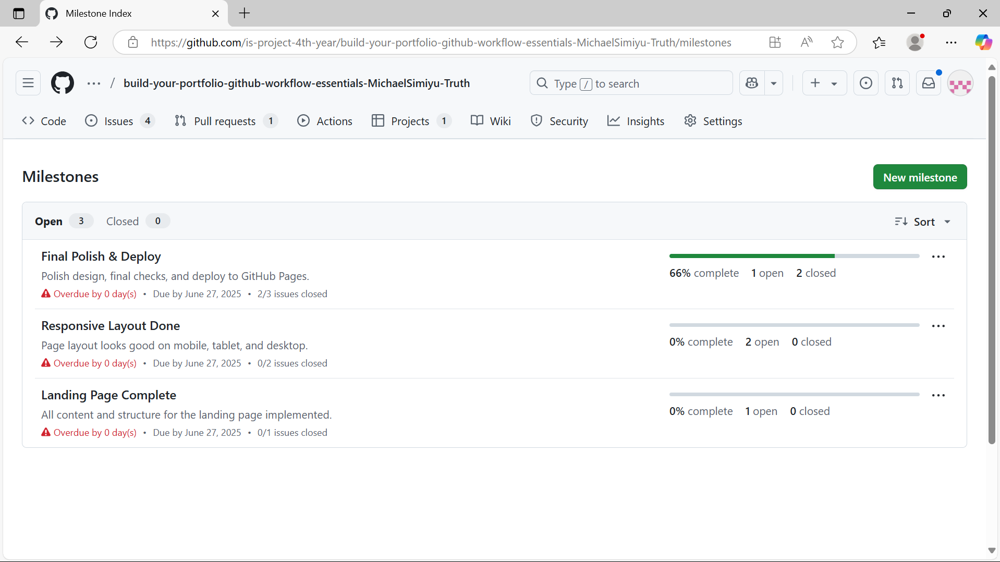
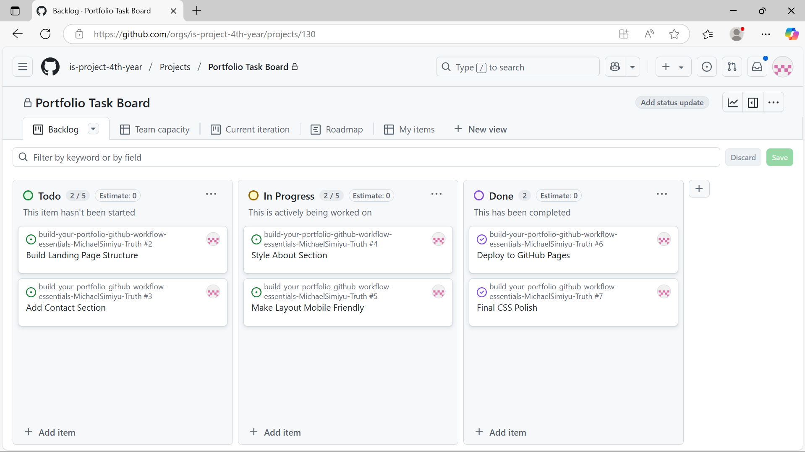
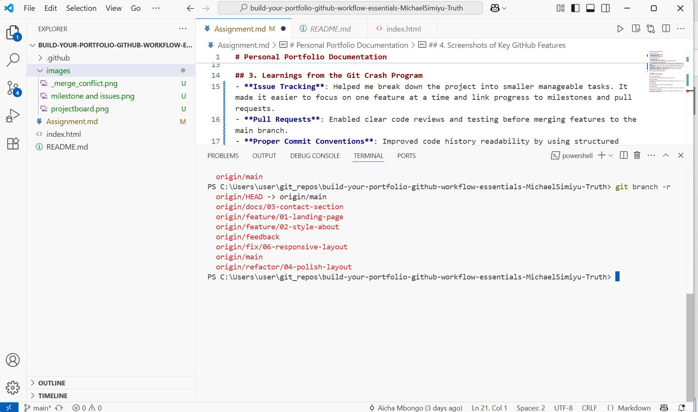
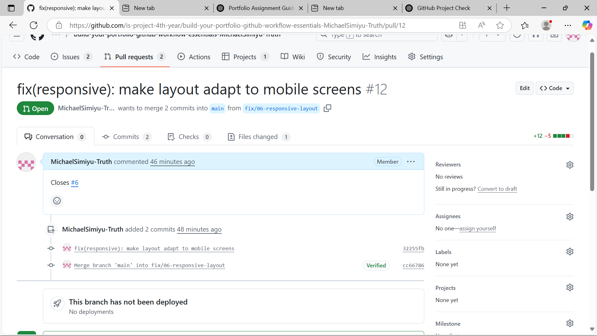
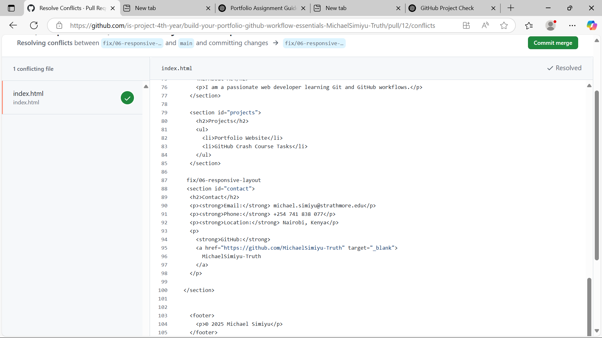

# Personal Portfolio Documentation

## 1. Student Details

- **Full name**:Simiyu, Michael Keith Wanjala
- **GitHub Username** MichaelSimiyu-Truth
- **Email**: michael.simiyu@strathmore.edu

## 2. Deployed Portfolio Link

- **GitHub Pages URL**:  
  _https://is-project-4th-year.github.io/build-your-portfolio-github-workflow-essentials-MichaelSimiyu-Truth/_

## 3. Learnings from the Git Crash Program
- **Issue Tracking**: Helped me break down the project into smaller manageable tasks. It made it easier to focus on one feature at a time and link progress to milestones and pull requests.
- **Pull Requests**: Enabled clear code reviews and testing before merging features to the main branch.
- **Proper Commit Conventions**: Improved code history readability by using structured commit types like `feat`, `fix`, `docs`, `style`, etc.
- **Merge Conflict Resolution**: I learned how to resolve conflicting code changes manually using both GitHub and VS Code tools.

## 4. Screenshots of Key GitHub Features

### A. Milestones and Issues
  
This screenshot shows how I created milestones for major goals and linked related issues to them for better tracking.

### B. Project Board
  
My GitHub Project Board with columns To Do, In Progress, and Done, showing issues moving through development stages.

### C. Branching
  
A list of feature branches like `feat/landing`, `style/about`, and `docs/contact` following naming conventions and task separation.

### D. Pull Requests
  
A pull request with a meaningful title and description, linked to an issue using "Closes #X" and following commit message standards.

### E. Merge Conflict Resolution
  
This screenshot captures the conflict resolution process between two branches editing the same line. I used GitHub to fix and merge it successfully.
